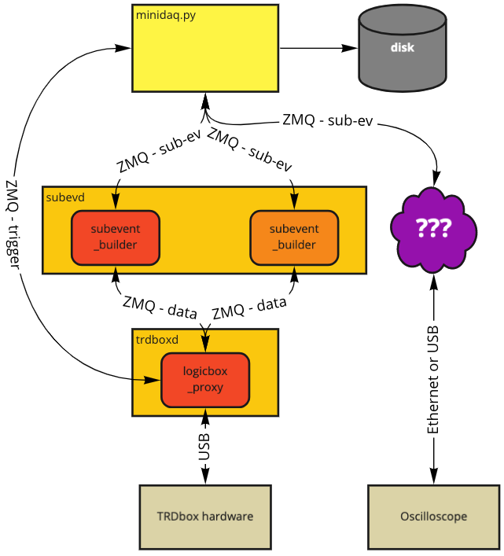

TRDbox C++ Software
===================

*This README was copied in April 2022 from instructions provided to the 2021 TRD prac. It should give a good overview, but details might have changed after the writing of these instructions.*

Links
-----

- https://github.com/tdietel/alicetrd-python - minidaq, evdump and other DCS utilities
- https://bitbucket.org/uctalice/trdbox/ - the C++ code for trdboxd and sevbldr


System overview
---------------


The overall data flow is shown above. From bottom to top:
- The TRDbox hardware sends the trigger to the TRD chamber and receives the data via two optical links.
- The logicbox_proxy makes the TRDbox hardware accessible via ZeroMQ.   It only provides low-level access: essentially read & write data either at single addresses or continuous memory blocks
- The subevent_builder instances read data blocks from the logicbox_proxy until they find an end-of-data marker. This data block is called a subevent: it is all the data that one sub-detector has for one event.
- minidaq.py is a Python script that initiates the readout by asking the logicbox_proxy to send a trigger and collecting the subevents from the subevent_builders afterwards.

The data flows between entities (we can call them objects, devices, or maybe something else...) like minidaq.py (Python script - yellow box), subevent_builder and logicbox_proxy (C++ classes). Each instance of a C++ class runs in it's own thread (shown as a red rounded box). At the moment, each of these classes has its own process, so that they can be debugged and restarted independently. In the future, they might all be merged into one multi-threaded process to make the communication more efficient and the startup a bit simpler.

TODO
----

- [X] Currently, the sevbldr always instantiates a subevent_builder for the same half of the TRD chamber. It therefore does not make sense to start two sevbldr instances. This should be changed: either the half-chamber is passed as an argument when starting the process, or the sevbldr starts threads.
- [ ] minidaq.py currently just sends a 'software' trigger that is not generated by the trigger logic. It will have to be modified to unblock the hardware trigger, wait for a trigger to occur and then start the readout.
- [ ] At the moment, minidaq.py receives the data from the chamber and displays the size. It should save it to disk.
- [ ] The oscilloscope should be integrated into this scheme.


Mini-Howto
----------

*This has been copied from last year's howto - some commands might have changed, but it should be a good starting point.*

In order to take data, you have to have `trdboxd` and `subevd` running in the "background" and use `minidaq.py` to control the actual readout.

trdboxd needs root privileges, so you have to start it with
```
sudo /usr/local/sbin/trdboxd
```

The subevent builder daemon `subevd` works as a normal user, so you can start with
```
/usr/local/sbin/subevd
```

At this point, we can only read out one half of the chamber, and therefore can only start one subevd process. You should only have one set of these services running.

It is useful to set up a tmux session to keep an eye on these processes. You can connect to it with
```
tmux -t trdbox
```
I suggest to always start these two programs from that tmux session, then everyone can see what’s happening.

Once these two programs are running you can go and run `minidaq` from the Python git repo. It’s best to clone it, set up a virtualenv and install it as described in the README.md. Then you can run it with
```
minidaq readevent
```

TRDbox status display
---------------------

The Python repository contains a script to display the status of the TRDbox. When you check out the repository, make sure to follow the instructions in the README to set up your environment.

You can get some help by just running `trdbox` without arguments, or by adding `--help`

You can display the most important status registers with:
```
# trdbox status
pre_conf   [0x100]: 0x0301fe04 = 50462212
pre_dgg    [0x101]: 0x03010301 = 50397953
pre_cnt    [0x102]: 0x00000001 = 1
pre_stat   [0x103]: 0x00000000 = 0
dis_conf   [0x28d]: 0x0000000f = 15
dis_freq0  [0x280]: 0x00000000 = 0
dis_freq1  [0x281]: 0x00000000 = 0
dis_time0  [0x284]: 0x238c34a7 = 596391079
dis_time1  [0x285]: 0x238c34a7 = 596391079
```

The most important ones for now are pre_conf, pre_dgg (for the (pre)trigger configuration, including the delay-gate-generators) and the dis_* registers.

There are also commands to set the discriminator config register `trdbox dis-conf` and the thresholds for the discriminators.
